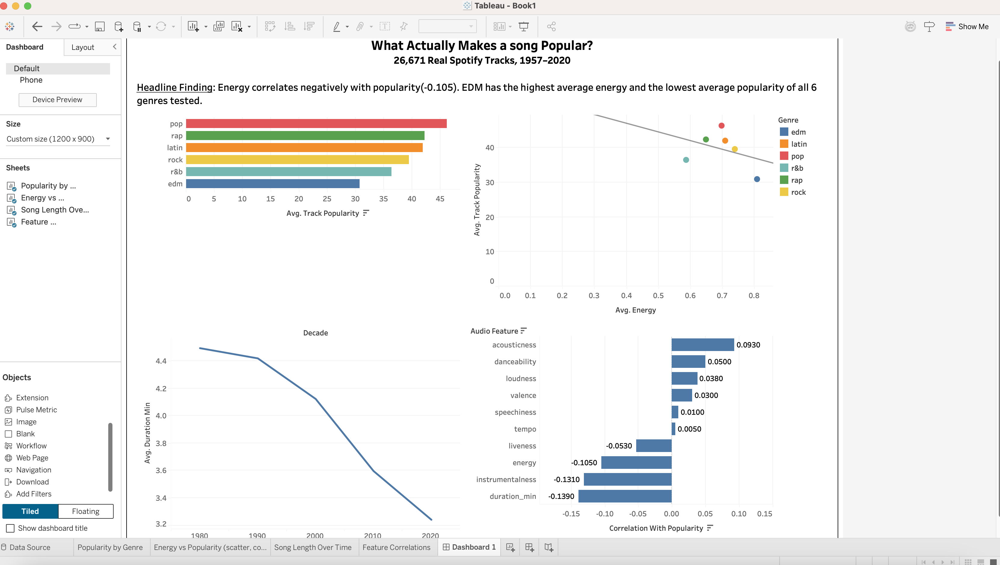

# What Actually Makes a Song Popular? — Spotify Analytics

**Live dashboard:** https://shehra-maker.github.io/Spotify-Analytics/
**Full findings:** [INSIGHTS.md](INSIGHTS.md)

A product analytics project on 26,671 real Spotify tracks (1957–2020), testing common
assumptions about what drives song popularity — using Python, SQL, Excel, and Tableau,
plus a live pull from the real Spotify Web API.

## The headline finding

High-energy tracks are *less* popular on average, not more (correlation: -0.105). EDM has
the highest average energy of any genre in this dataset and the lowest average popularity.
Full breakdown in [INSIGHTS.md](INSIGHTS.md).

## Tableau Dashboard

Built in Tableau Desktop — 4 linked charts covering genre performance, the energy/popularity
relationship, feature correlations, and song length trends over time.

## About the data

Source: the real, well-known [TidyTuesday Spotify dataset](https://github.com/rfordatascience/tidytuesday/tree/master/data/2020/2020-01-21)
(originally Spotify's own audio-feature data, 32,833 tracks across 6 playlist genres and
24 subgenres). This is genuine historical data, not synthetic.

A live component pulls **current** popularity data from Spotify's real API
(`api/pull_live_spotify_data.py`) — see that file for an important caveat: Spotify
permanently deprecated the audio-features endpoint for new developer apps in Nov 2024, so
the live pull gets popularity/metadata but not live audio features. This is disclosed
openly rather than hidden.

## What's in each folder

docs/     the live interactive dashboard (index.html + data.json)
data/     clean_data.py, spotify_songs_raw.csv, spotify_clean.csv, tableau_export.csv
sql/      schema.sql, build_db.py, analysis_queries.sql, spotify.db, query_results.json
excel/    build_excel.py, spotify_analysis.xlsx
api/      pull_live_spotify_data.py
tableau/  spotify_analysis.twbx (open in Tableau Desktop or Tableau Public to explore)

INSIGHTS.md    full findings + recommendations

## SQL (sql/analysis_queries.sql)

Six queries: genre-level feature averages, an energy-quartile popularity breakdown (the
query behind the headline finding), song length by decade, subgenre overperformance vs.
parent genre (window function + CTE), top artists (min. 5 tracks to avoid one-hit outliers
skewing an average), and a "hit sweet spot" comparison across popularity tiers.

## Excel (excel/spotify_analysis.xlsx)

Four tabs, every summary number computed with live formulas (`AVERAGEIF`, `COUNTIF`,
`CORREL`, `QUARTILE`) referencing the Raw Data tab — not pasted-in values. Cross-checked
against the SQL layer; both produce identical numbers.

## Tools

Python (pandas) · SQL (SQLite) · Excel (openpyxl, live formulas) · Tableau ·
Spotify Web API (Client Credentials flow) · Chart.js

